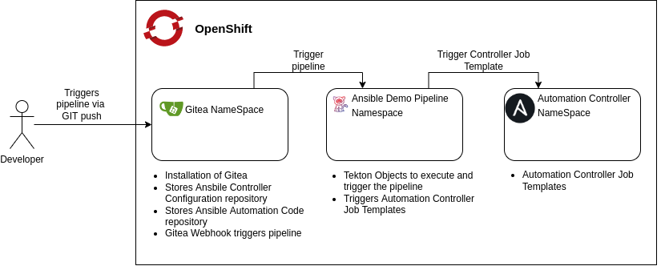
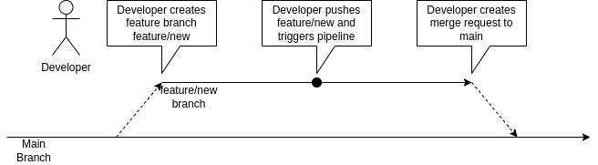
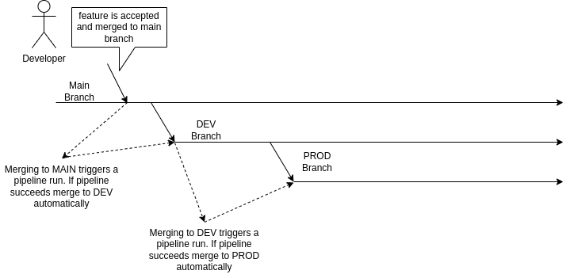

# Ansible Pipeline Demo

This repository contains a simple pipeline that demonstrate how to

- Validate Ansible code in an automated fashion
- Merging changes automatically to different repository branches after
  validation
- Triggering Ansible Controller jobs after merging

The demo is running in OpenShift, for reasons why see [here](#why-openshift).

## Table of contents

* [Motivation](#motivation)
* [Tools](#tools)
* [Pipeline overview](#pipeline-overview)
* [Proposed developer workflow](#proposed-developer-workflow)
* [Why OpenShift?](#why-openshift?)
* [Prerequisites](#prerequisites)
* [Infrastructure setup](#infrastructure-setup)
* [Preparing required content](#preparing-required-content)

## Motivation

Using Ansible for automation is only the starting point to a longer
journey. For most larger automation setups the following questions
arise after automating the first tasks:

- How can we test our Ansible code base before applying it to
  production systems?
- Which tools are available for testing Ansible code?
- Is it possible to fully automate the whole workflow of testing
  Ansible code and bringing it to production?

Answering the questions above when starting with a blank page is
hard. There are multiple solutions and even more tools to achieve the
desired result.

This Demo setup tries to answer some of these questions. We only
scratch the surface of what's actually possible. It's not the
definitive answer but should help getting started without staring at
that annoying blank page.

## Tools

We use the following tools to implement our pipeline

- [Gitea](https://gitea.io/en-us/):
  - Storing our Ansible code base and
  - our Ansible Controller configuration
- [Tektion](https://tekton.dev/) for implementing our pipeline
- [Ansible Controller](https://www.ansible.com/products/controller)
  for executing Ansible code

## Pipeline overview

The graphic depicts our proposed setup:



We are going to deploy required tools in 3 separate OpenShift namespace:

- Gitea: for installation of Gitea
- ansible-pipeline: for storing required Tekton pipeline objects like
  - Tasks
  - Pipelines
  - EventTriggers
- ansible-automation-platform: for our installation of a minimal
  Automation Controller instance

Don't worry about setting up all those tools, we got you covered
here. See section [Setup](#Setup).

You might ask yourself why the heck is this running in OpenShift?
Please see [here](#why-openshift) for an explanation.

## Proposed developer workflow

The basic idea is to implement the following developer workflow

1. Developer checks out git repository with automation code
1. Developer creates feature branch in automation code repository
1. Developer pushes feature branch to central repository
1. Push trigger creates a separate feature environment in Automation Controller for testing the feature branch
1. Developer modifies / extends automation code
1. Developer commits automation code changes and pushes feature branch to Gitea
1. Push triggers a pipeline run that verifies changes with _ansible-lint_
1. Code can also be test by trigging the feature branch environment in Automation Controller
1. If verification is ok, developer can open pull request to *DEV* branch
1. If request is merged, Developer can delete feature branch
1. Feature environment in Controller gets removed
1. Push to *DEV* branch triggers a pipeline that executes a Automation
   Controller Job Template that executes the code in the *DEV* branch
   on test servers
1. If Job Template execution did *NOT* produce any errors code is
   automatically merged into the *PROD* branch.

This is just a very simple implementation of a possible pipeline but
we think it demonstrates the basic building blocks required.

What is a feature branch environment in Automation Controller?

This basically means that we create a separate Project in Automation
Controller that points to the git repository with the feature
branch. Furthermore we also create a new Job Template that executes code
in the feature branch on a number of selected hosts.

### Creating a new feature




### Releasing a new feature



## Why OpenShift?

Simple because we can and OpenShift provides an easy way of setting up
our infrastructure via tools like [Helm](https://helm.io) or
[Operators](https://operatorhub.io/).

OpenShift is not a strong requirement, any Kubernetes distribution or
even upstream Kubernetes could also be leveraged.

> :warning: **Persistent storage is required**: For Gitea and the
> Automation Controller you are going to need persistent storage in
> OpenShift or Kubernetes.

Deploying our pipeline would also be possible without OpenShift. The
only thing that needs to be replaces is Tekton. But there are plenty
of tools available for replacement:

- [Jenkins](https://www.jenkins.io) for the classic CI/CD tooling
- [Gitlab pipelines](https://docs.gitlab.com/ee/ci/pipelines/)

or various pipelines as a service implementations like

- [Circle CI](https://circleci.com/)
- [Travis](https://www.travis-ci.com/)

## Prerequisites

Running the pipeline was tested on an OpenShift 4.10 cluster with
[rook-ceph](https://rook.io/) for persistent storage.

Tekton and Ansible Controller are installed via
[OLM](https://olm.operatorframework.io/) so to use the setup procedure
described in [Setup](#setup) you also need an installation of OLM.

You also need the following tools installed, either via a container or
locally:

- Python 3
- Ansible

The `setup` Makefile tasks tries to install required Python 3
dependencies via [](collections/requirements.txt) and required Ansible
collections via [](collections/requirements.yml).

## Infrastructure setup

The root directory of this repository contains a [Makefile](Makefile)
to set everything up. Just run

```
make help
```
to get a list of available targets:

```
Usage: make <OPTIONS> ... <TARGETS>

Available targets are:


Usage:
  make <target>
  help             Show this help screen
  pythonlibs       Install required python libraries
  collections      Install required collections
  setup            Run setup playbook
  toc              Generate a simple markdown toc, does not support levels!
```

So

```
make setup
```

should

- Install Tekton pipelines via OLM
- Install Gitea in the `gitea` namespace
- Push a template collection to the
  `developer/ansible-example-collection` repository
- Install Ansible Automation Controller in the
  `ansible-automation-platform` namespace again via OLM

After running `make setup` you will receive a message with

- The URL for your Gitea instance
- Username and password for Gitea
- The URL for the Automation Controller
- Username and password for the Automation Controller

For example:

```
TASK [Print Ansible Controller route] ********************************************************************************************************************************************************ok: [localhost] => {
    "msg": [
        "Ansible Controller user    : admin",
        "Ansible Controller password: jwQPEvXwmSVT57edYzmPF9yDEOXnzwQ3",
        "Ansible Controller URL     : https://ctrl.apps.ocp.lan.stderr.at",
        "",
        "Go to https://ctrl.apps.ocp.lan.stderr.at and add a subscription!",
        "After adding the subscription execute 'make controller-content"
    ]
}
```

## Preparing required content

For getting the Automation Controller ready you need to provide a
valid subscription upon first login.

After adding a subscription run

```
make controller-content
```

to prepare Ansible Controller for this demo. This will

- Create a development and production project
- Create one job template to configure development hosts
- Create one job template to configure production hosts

## Possible improvements to the pipeline

- Work with collections and Automation Hub
  - Same workflow, create feature branch in collection repo
  - Test feature branch via pipeline and/or Controller jobs
  - Merge feature to main and release
- Extend testing of playbooks
  - Use [molecule](https://molecule.readthedocs.io/en/latest/index.html) in the pipeline

## setup.yml options

```
gitea_skip_gitea: [yes|no] Skip Gitea setup
controller_subscription_installed: [yes|no] Does the Ansible Automation Controller have a valid subscription?
```
